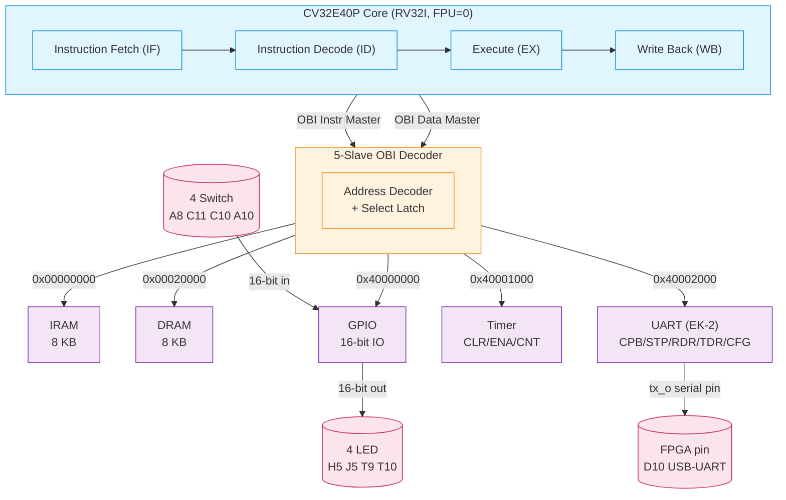
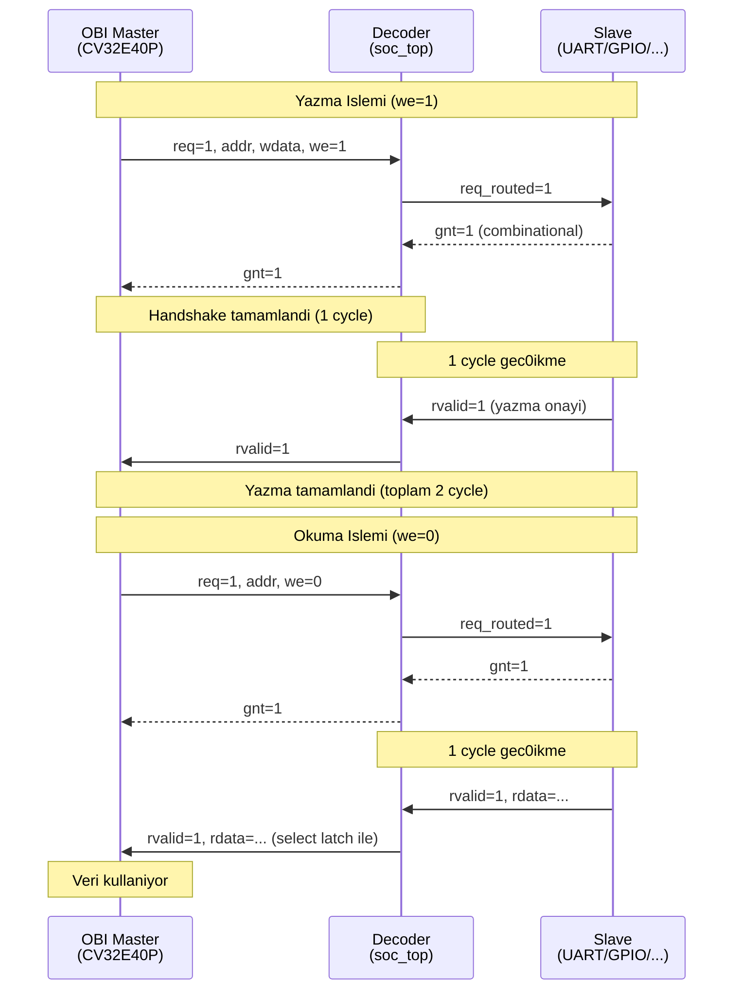
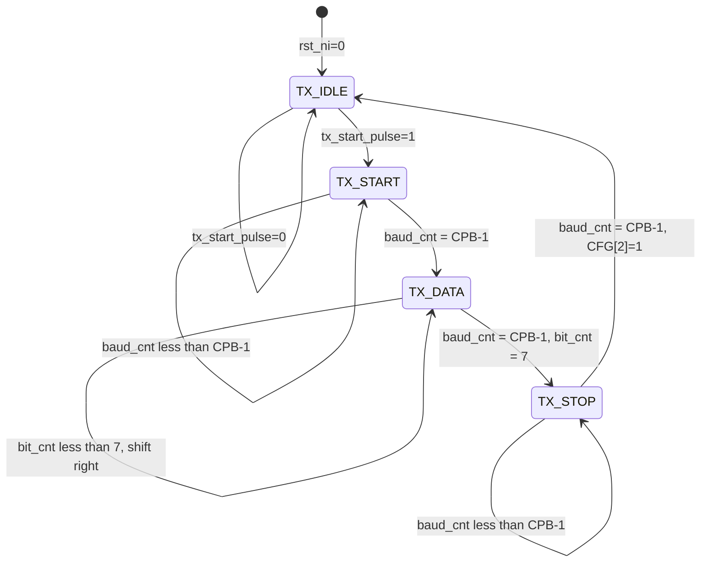

# ZUGA-IC Mimari Diyagramlari

**Takim:** ZUGA-IC | TEKNOFEST 2026 Cip Tasarim Yarismasi
**Versiyon:** v1 (27 Nis 2026)
**Kaynak Milestone'lar:** M01-M11

Bu doküman sistem mimarisinin gorsel anlatimini icerir. DTR Raporu
Bolum 3 (Sistem Mimarisi) icin kanit kaynaktir. Mermaid syntax ile
yazilmistir; GitHub otomatik render eder.

---

## Diyagram 1: Sistem Genel Gorunumu

CV32E40P RISC-V cekirdegi, ozel OBI decoder ve 5 slave modul.

### Akis Acıklamasi

1. **Cekirdek (CV32E40P):** 4-stage in-order pipeline. IF asamasi
   instruction master OBI'dan instruction okur, EX/WB asamasi data
   master OBI'dan veri okur/yazar.

2. **Decoder:** Iki masterdan gelen istekleri (req) adres on-eklerine
   gore 5 slave'den birine yonlendirir. Select latch pattern ile
   rvalid timing'inde dogru rdata seçimini garanti eder.

3. **Slaves:**
   - **IRAM** (0x00000000-0x00001FFF): Program kodu, dual-port
   - **DRAM** (0x00020000-0x00021FFF): Veri (henuz aktif kullanim yok)
   - **GPIO** (0x40000000-0x40000FFF): IDR/ODR, 16-bit pin
   - **Timer** (0x40001000-0x40001FFF): CLR/ENA/CNT
   - **UART** (0x40002000-0x40002013): EK-2 5 yazmac, gerc0ek 10-bit TX

4. **Disari Bagli Pinler (FPGA):**
   - `tx_o` -> D10 (USB-UART kopru, FPGA -> PC)
   - `gpio_out[3:0]` -> H5, J5, T9, T10 (4 LED)
   - `gpio_in[3:0]` <- A8, C11, C10, A10 (4 switch)

---

## Diyagram 2: OBI Bus Handshake Akisi

OBI (Open Bus Interface) protokolu: master istek (req) gonderir,
slave hazir oldugunda gnt verir, sonra rvalid ile cevap doner.

### OBI Protocol Kurallari (M07'de Test Edilen)

Diyagram 2'deki akis 3 protocol assertion ile kontrol edilir:

1. **Rule 1 - gnt sadece req aktifken:** Slave keyfi gnt cikamaz.
2. **Rule 2 - handshake -> rvalid:** Handshake'den 1 cycle sonra
   rvalid gelmeli (gec0ikmemeli).
3. **Rule 3 - rvalid sadece handshake sonrasi:** Idle'da rvalid
   spurious olarak cikamaz.

Detay: docs/milestone_07_sva_protocol_check.md

### Select Latch Pattern (M02'den)

Bizim slave'lerde `gnt = req` (combinational, anında). Ama rvalid
1 cycle sonra cikar. Bu durumda decoder mux yanlis cevap secebilir
(orijinal addr unutuldu). Cozum: select sinyallerini flip-flop ile
latch et:

---

## Diyagram 3: UART Faz 2 TX State Machine

UART modulu Faz 2 (M09) gerc0ek 10-bit TX state machine ile
sentezlenebilir hale getirildi. State akisi asagidaki gibidir:

### Durum Aciklamalari

- TX_IDLE: Bekleme. tx_o = 1 (idle high). Yeni TDR yazma +
  CFG[0]=1 ile baslar (tx_start_pulse).
- TX_START: Start bit. tx_o = 0. CPB cycle bekler.
- TX_DATA: 8 data bit, LSB first. Her CPB cycle bir bit, shift
  register sag-kaydir. bit_cnt 0-7 arasi.
- TX_STOP: Stop bit. tx_o = 1. CPB cycle bekler. CFG[2]
  (TX_DONE) set edilir.

### Zamanlama (CPB=16 default, simulator)

Bir karakter gonderme suresi: 10 bit (1 start + 8 data + 1 stop)
* 16 cycle = 160 cycle, @ 50 MHz = 3.2 us per karakter.

FPGA da yazilim CPB ye 5208 yazinca: 10 * 5208 = 52080 cycle /
karakter, @ 50 MHz = 1.04 ms / karakter, baud rate = 9600 (standart
UART hizi).

### R (0x52) Ornek Waveform

ASCII R = 0x52 = binary 01010010.
LSB first gonderim sirasi: 0,1,0,0,1,0,1,0

| Cycle  | State   | tx_o | Aciklama        |
|--------|---------|------|-----------------|
| 0-15   | IDLE    | 1    | Bekleme         |
| 16-31  | START   | 0    | Start bit       |
| 32-47  | DATA0   | 0    | LSB (bit 0)     |
| 48-63  | DATA1   | 1    | bit 1           |
| 64-79  | DATA2   | 0    | bit 2           |
| 80-95  | DATA3   | 0    | bit 3           |
| 96-111 | DATA4   | 1    | bit 4           |
| 112-127| DATA5   | 0    | bit 5           |
| 128-143| DATA6   | 1    | bit 6           |
| 144-159| DATA7   | 0    | bit 7 (MSB)     |
| 160-175| STOP    | 1    | Stop bit        |
| 176+   | IDLE    | 1    | Bekleme         |

M09 simulasyonunda bu waveform testbench tx_o izleyicisi ile
dogrulandi. 8 edge gozlendi (bit gec0isleri).

---

## DTR Raporu Referanslari

Bu diyagramlar DTR Raporu Bolum 3 (Sistem Mimarisi) icin kullanilir:

- Diyagram 1 -> DTR 3.1 (Genel Blok Diyagrami)
- Diyagram 2 -> DTR 3.4 (OBI Bus Mimarisi) + Bolum 6 (Doğrulama)
- Diyagram 3 -> DTR 4.3 (UART Modulu) + Bolum 9.1 (Sentez)

GitHub da bu dosya acildiginda Mermaid diyagramlari otomatik olarak
render edilir.

Ekran goruntusu icin: GitHub da dosyayi ac, mermaid kodu render
edildikten sonra sayfayi yakalat (browser print to PDF veya
screenshot tool).
